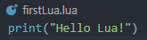
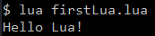
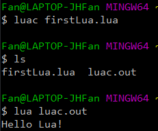

# Lua简介
Lua是一种轻量级 , 易于嵌入到C/C++中的脚本语言 .  
Lua是动态数据类型的 , 并且拥有自动内存管理和垃圾回收的机制 .  
#### 用处
在诸如游戏开发等方面 , Lua是常用的脚本语言 .  
通常使用Lua描述顶层逻辑 , 使用C++实现底层功能 .  

---

# 安装配置
在Linux / MacOS中直接下载源码使用make编译即可 .  
Windows中将源码拷贝到VS工程中编译 , 或直接下载编译好的可执行文件即DLL库 .  

使用make编译后可得到 `lua` 以及 `luac` 两个可执行文件 , 在windows平台下还有lua.dll库 .  
其中 `lua` 是解释器 `luac` 是编译器 . Lua的轻量级由此可见一斑 .  

若需要可以自行配置环境变量 .  

---

# 测试
Lua的文件后缀为 `.lua` .  
可以直接使用 `lua filename.lua` 解释执行 , 也可以使用 `luac filename.lua` 编译获得out文件 .  

### 示例 (Code/firstLua/firstLua.lua)
编写一个简单的lua文件 `fitstLua.lua` :  
    
#### 解释执行
使用 `lua firstLua.lua` 解释执行可输出 :   
  
#### 编译执行
使用 `luac firstLua.lua` 编译可得out文件 `luac.out` , 再使用 `lua luac.out` 执行可输出 :  

