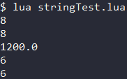

<div id="注释"></div>

# 注释
***单行注释*** : `-- 注释内容`  
***多行注释*** : `--[[ 注释内容 ]]`

---

<div id="数据类型"></div>

# 数据类型
Lua是动态类型语言 , 变量无需指定数据类型 , 只要赋值即可 .  

#### Lua的基本数据类型汇总
|数据类型|描述|
|-|-|
|nil|***空*** . 代表一个无效值 , 可视为 null 和 false|
|boolean|***布尔类型*** . 值有 true 和 false|
|number|***数字*** . 就是double|
|string|***字符串*** . 用一对单引号或双引号包围|
|fuction|***函数*** . 由C或Lua编写的函数|
|userdata|***自定义类型*** . 表示任意存储在变量中的C数据结构|
|thread|***线程*** . 表示执行的独立线程|
|table|***表*** . 本质是一个关联数组(associative arrays)|

#### 示例 (Code/secondLua/simpleTest.lua)
```Lua
-- 数据类型测试
print(type("Hello world"))      --> string
print(type(10.4*3))             --> number
print(type(true))               --> boolean
print(type(nil))                --> nil
print(type(type))               --> function
print(type(type(X)))            --> string
```
#### 输出


---

<div id="nil"></div>

# nil (空)
`nil` 类型表示空值 , 若输出一个没有被赋值的变量 , 则会输出 `nil` .  

对于全局变量和 `table` , `nil` 还有一个删除功能 : **为一个全局变量或 `table` 赋值 `nil` 相当于删除该变量** .  
#### 示例 (Code/secondLua/nilTest.lua)
```Lua
tab1 = {key1 = "val1", key2 = "val2"}
for k, v in pairs(tab1) do
  print(k .. " - " .. v)
end
-- 使用赋值nil删除变量
tab1.key1 = nil
for k, v in pairs(tab1) do
  print(k .. " - " .. v)
end
```
#### 输出


---

<div id="boolean"></div>

# boolean (布尔)
在Lua中 , `false` 和 `nil` 表示**假** , 其余的值(包括0)都表示**真** .
#### 示例 (Code/secondLua/booleanTest.lua)
```Lua
print(type(true))
print(type(false))
print(type(nil))
-- 测试nil的boolean值
if false or nil then
  print("至少有一个是true")
else
  print("false和nil都是false")
end
-- 测试0的boolean值
if 0 then
  print("0是true")
else
  print("0是false")
end
```
#### 输出


---

<div id="number"></div>

# number (数字)
Lua中所有数字默认都属于double类型 , 可以在luaconf.h中修改默认类型 .  

---

<div id="string"></div>

# string (字符串)
可以使用一对单引号或双引号表示一行字符串 , 也可以用两个方括号`[[ 字符串 ]]`来表示多行字符串 .  
字符串之间使用 `..` 符号进行连接 . 使用 `#` 可对字符串计算长度 , 放在字符串前 .  

当 `string` 与其他类型数据进行连接时 , Lua会尝试将其他数据类型都转换为 `string` .  
当对 `string` 进行算数操作时 , Lua会尝试将其转换为 `number` 类型 .  
#### 示例 (Code/secondLua/stringTest.lua)
```Lua
print("2" + 6)
print("2" + "6")
print("2e2" * "6")
str = "qwerty"
print(#str)
print(#"qwerty")
```
#### 输出


---

<div id="table"></div>

# table (表)
简单的理解可以将table视作 array 与 map 的合体 .  

在Lua中 , `table` 通过"构造表达式"来完成 , 例如`{}`用来创建一个空表 , 也可以在里面添加数据初始化表 .    
Lua的表不同于其他语言的数组 , 其**索引从1开始** , 且**不固定长度** , 且**表内元素可不同类型**.  

`table` 实际上是一个"关联数组"(associative arrays) , **数组的索引可以是数字或者是字符串** .

#### table的索引
对于table的索引有两种方式 :
1. `table[key]`   -- 针对所有索引类型都可用
2. `table.key`    -- 当索引类型是字符串时的简化写法

使用 `#` 可对table计算元素个数 , 放在变量名前 .  
#### 示例 (Code/secondLua/tableTest.lua)
```Lua
-- 创建一个空table
tbl1 = {}
-- 创建一个table并初始化
tbl2 = {1, 2, 3}
-- 创建一个table , 并进行赋值操作 , 修改值操作 , 遍历输出操作
a = {1, 2, 'var'}
a.key = "value"
key = 10
a[key] = 22
a[key] = a[key] + 11
for k, v in pairs(a) do
  print(k .. ":" .. v)
end
```
#### 输出


---

<div id="function"></div>

# function (函数)
在Lua中 , 函数被视为变量(第一类值) .  
说明函数**可以在变量之间赋值传递** , 也**可以通过匿名函数(不指定函数名)的方式作为参数传递** .  
#### 示例 (Code/secondLua/functionTest.lua)
```Lua
-- 定义函数
function func(n)
  return n
end
function printNumber(a, b, c)
  print(a + b + c())
end
-- 使用函数赋值变量
func2 = func
-- 使用函数传参
printNumber(func(5), func2(5), 
  function ()
    return 5
  end
)
```
#### 输出


---

<div id="thread"></div>

# thread (线程)
在Lua中 , 最主要使用的并发方式是协程(coroutine) .  

携程与线程类似 , 有自己的栈 , 局部变量 , 指令指针 , 与其他携程共享全局变量等 .  
***区别*** : 线程可同时运行多个 , 而协程同时只能运行一个 , 处于运行状态的携程只有被挂起(suspend)时才暂存 .  

---

<div id="userdata"></div>

# userdata (自定义类型)
userdata是一种用户自定义数据 , 用于表示一种由应用程序或C/C++库所创建的类型 .  
可以将C/C++的任意数据类型的数据(通常是struct 或 指针)存储到Lua变量中调用 .  