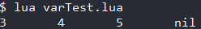
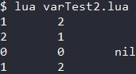

<div id="变量"></div>

# 变量
Lua支持动态数据类型 , 定义变量无需指定诸如int等关键字 , 只需要变量名和值即可 .  

***Lua的变量有三种类型*** :
1. **全局变量** : 定义方式 : `变量名 = 值` 
2. **局部变量** : 定义方式 : `local 变量名 = 值` 
3. **表中的域**

#### 全局变量
直接在Lua文件空白处定义的变量默认是全局的 , 即便是在语句块或方法里.  
直接访问未初始化的全局变量不会出错 , 默认值是 `nil` . 若想删除一个全局变量 , 将其赋值为 `nil` 即可 .  

#### 局部变量 - local关键字
只有使用了local关键字定义的变量才是局部变量 , 其作用域在其所在的代码块/方法中 .  

**应尽可能使用局部变量** , 原因有二 : 
1. 避免命名冲突
2. 访问局部变量的速度高于全局变量

#### 示例 (Code/thirdLua/varTest.lua)
```Lua
a = 3             -- 全局变量
local b = 4       -- 局部变量
function fooFunc()
  c = 5           -- 全局变量
  local d = 6     -- 局部变量
end
fooFunc()
print(a, b, c, d) --> 3 4 5 nil
```
#### 输出


<div id="变量/赋值语句"></div>

## 赋值语句
Lua可对多个变量同时赋值 , 变量列表和值列表的各元素用逗号分开 , 赋值语句右边的值会一次赋给左边的变量 .  
`变量1 , 变量2 = 值1 , 值2`  

遇到赋值语句Lua会先计算右侧所有的值再执行赋值操作 , 所以可以利用赋值语句交换变量的值 .  
`变量1 , 变量2 = 变量2 , 变量1` 

当变量数与值数不一致时 , Lua采取以下策略 :
1. **变量个数 > 值的个数** : 未能赋值的变量补nil
2. **变量个数 < 值的个数** : 多余的值被忽略

#### 示例 (Code/thirdLua/varTest2.lua)
```Lua
a, b = 1, 2     -- 给多个变量赋值
print(a, b)     --> 1 2
a, b = b, a     -- 交换变量的值
print(a, b)     --> 2 1
a, b, c = 0, 0  -- 变量个数 > 值的个数
d, e = 1, 2, 3  -- 变量个数 < 值的个数
print(a, b, c)  --> 0 0 nil
print(d, e)     --> 1 2
```
#### 输出


---

<div id="运算符"></div>

# 运算符
Lua的运算符与C/C++基本一致 , 区别主要在于语法上 , 并且相对地增加一些Lua特有的运算符 .  

***Lua提供了以下几种运算符类型*** :
- **算术运算符** 包括 : `+` `-` `*` `/` `^` `-`
- **关系运算符** 包括 : `==` `~=` `>` `<` `>=` `<=`
- **逻辑运算符** 包括 : `and` `or` `not`
- **其他运算符** 包括 : `..` `#`

#### 算术运算符
|操作符|描述|示例|
|-|-|-|
|**+**|**加法**|10 + 20 输出 30|
|**-**|**减法**|10 - 20 输出 -10|
|**\***|**乘法**|10 * 20 输出 200|
|**/**|**除法** (除尽)|5 / 3 输出 1.6666666666667|
|**%**|**取余**|5 % 3 输出 2|
|**^**|**乘幂**|10 ^ 2 输出 100|
|**-**|**负号**|-10 输出 -10|

#### 关系运算符
|操作符|描述|示例|
|-|-|-|
|**==**|**等于** . 相等返回true , 不等返回false|10 == 20 输出 false|
|**~=**|**不等于** . 不等返回true , 相等返回false|10 ~= 20 输出 true|
|**>**|**大于** . 左边大于右边返回true , 否则返回false|10 > 20 输出 false|
|**<**|**小于** . 左边小于右边返回true , 否则返回false|10 < 20 输出 true|
|**>=**|**大于等于** . 左边大于或等于右边返回true , 否则返回false|10 >= 20 输出 false|
|**<=**|**小于等于** . 左边小于或等于右边返回true , 否则返回false|10 <= 20 输出 true|

#### 逻辑运算符
|操作符|描述|示例|
|-|-|-|
|**and**|**逻辑与** . 若左边为false则返回左边 , 否则返回右边|true and false 输出 false|
|**or**|**逻辑或** . 若左边为true则返回左边 , 否则返回右边|true or false 输出 true|
|**not**|**逻辑非** . 对逻辑运算的结果取反|not (true and false) 输出 true|

#### 其他运算符
|操作符|描述|示例|
|-|-|-|
|**..**|**连接** . 连接两个字符串|"Hello" .. [[Lua]] 输出 'HelloLua'|
|**#**|**取长** . 对于字符串 , 取其长度 ; 对于数组 , 取其元素个数|print(#"str") 输出 3 ; print(#{4, 5}) 输出 2|
***注*** : 对于table使用 `#` 运算符时 , 只取"**用整数作为索引的最开始连续部分的最大索引**" .  
因此 , 只有使用数组的时候才适合使用 `#` 对table进行操作 .  
***详见下面的例子*** : `(Code/thirdLua/operatorTest.lua)`
```Lua
local tab1 = {1, 2, 3}
tab1[2] = nil
print(#tab1) --> 3 , 这里 用整数作为索引的最开始连续部分是1:1 3:3 ,最大索引是3
local tab2 = {k1 = "a", 1, k2 = "1"}
print(#tab2) --> 1 , 这里 用整数作为索引的最开始连续部分是1:1 , 最大索引是1
```