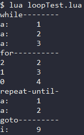
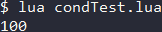
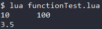

<div id="循环"></div>

# 循环
Lua提供了4种循环方式 , 与其他语言的循环基本一样 , 只是语法上有一些区别 : 
|循环类型|描述|
|-|-|
|while|每次循环前检查条件 , 条件为true时继续执行循环 , 条件为false时退出循环|
|for|由for的控制语句决定是否继续执行循环体|
|repeat-until|重复执行循环 , 直到条件为真时退出循环|
|嵌套循环|各种循环体可用嵌套使用|

Lua提供了2种循环控制语句 , 与其他语言的控制语句基本一样 , 但是**Lua没有continue** : 
|控制语句|描述|
|-|-|
|break|退出当前循环|
|goto|将程序的控制点转移到一个标签处|
#### while循环
***语法*** : `while(条件表达式) do 循环体 end`  
其中条件语句可以使用()包围 , 也可以不使用 .  
#### for循环
***语法*** : `for <var> = <strat>, <end>, <step> do 循环体 end`  
`<var>` : 循环变量 .  
`<strat> <end>` : 循环变量的遍历区间 , 是一个闭区间 (**循环变量的值在两端时都会进入循环体**)  
`<step>` : 循环变量遍历的步长 , 缺省值为1 .  

for循环中的三个表达式在循环开始前一次性求值 , 之后便不再求值 .  
因此若表达式中出现的变量在循环体中被修改了 , 也不会影响到循环体 .  

`<strat> <end>`表示的是一个闭区间[strat, end] , 因此也可以直接使用一个闭区间代替 .  
#### repeat-until循环
***语法*** : `repeat 循环体 until(条件表达式)`  
其中条件语句可以使用()包围 , 也可以不使用 .  

Lua中的repeat-until循环与C/C++中的do-while循环类似 ,  
**二者的区别在于** : 前者的条件表达式达成时退出循环 , 后者的条件表达式达成时继续循环 .  
#### break语句
Lua中的break语句与C/C++的break语句使用上无异 , 其用于在循环中跳出循环 .  
#### goto语句
goto语句用于跳转到标记处 , 分为设置标记 与 跳转标记两步 .  
***跳转标记*** : `:: 标记名 ::`    ***设置标记*** : `goto 标记名`  

使用goto语句可用实现continue的功能 :  
在循环体末尾处设置 `::continue::` 标记 , 在需要continue处使用 `goto continue` 语句.  
#### 示例 (Code/loop-cond-func/loopTest.lua)
```Lua
---------- while ----------
print("while--------")
a = 1
while(a < 4) do
  print("a:", a)
  a = a + 1
end
---------- for ----------
print("for----------")
x = 3
for i = 1, x do
  x = x - 1
  i = i + 1
  print(x, i)
end
---------- repeat-until ----------
print("repeat-until-")
a = 1
repeat
  print("a:", a)
  a = a + 1
  if a == 3 then
    break
  end
until(a > 3)
---------- goto ----------
print("goto---------")
for i = 1, 10, 2 do
  if i <= 8 then
    goto continue
  end
  print("i:", i)
  ::continue::
end
```
#### 输出


---

<div id="分支"></div>

# 分支
Lua的分支语句与C/C++差不多 , 都是if-elseif-else , 区别只在于语法 .  
**Lua不提供swtich-case语句** .  
## if-else 语句
***语法*** : `if 条件1 then 执行语句1 else if 条件2 then 执行语句2 else 执行语句3 end`  
其中条件语句可以使用()包围 , 也可以不使用 .  
#### 示例 (Code/loop-cond-func/functionTest.lua)
```Lua
-- 定义方法max(a,b)返回两数中较大者
function max(a, b)
  if a > b then
    return a
  elseif a < b then
    return b
  else
    return b
  end
end
-- 调用函数max(a,b),传入50,100. 并将结果输出.
print(max(50, 100))
```
#### 输出


---

<div id="方法"></div>

# 方法 - 关键字function
***定义语法*** : `[local] function 方法名(参数列表) 方法体 return 返回值列表 end`  
Lua中的方法也是属于普通数据类型 , 因此也有全局与局部之分 , 默认是全局的 .  

Lua的方法**无需指定返回值类型** , 并且支持**多返回值**与**可变参数列表** .  
#### 多返回值
Lua的方法可用返回多个结果值 , 在 `return` 后列出返回值列表即可 , 返回值中间用 `,` 隔开 .  
#### 可变参数列表
Lua的方法支持可变参数列表 , 在参数列表中使用 `...` 表示有可变的参数 .  
- 使用 `{...}` 获得参数列表 . 传入的可变参数可视为一个table `{...}` .  
- 使用 `select('#',...)` 获取参数个数 , 使用 `select(n,...)` 获取第n个参数后的参数个数 .  
- 使用 `arg` 变量可以直接获取参数列表与参数的个数 . (仅限Lua 5.2版本之前)  
`arg` 是一个table , 最后一个元素为参数个数 , 其他元素表示参数列表 .  

#### 示例 (Code/loop-cond-func/functionTest.lua)
```Lua
-- 定义方法 printNum(num) 其返回传入的参数
function printNum(num1, num2)
  return num1, num2;
end
print(printNum(10, 100))
-- 定义方法 average(...) 其返回一组数的平均值
function average(num, ...)
  local result = 0
  local arg = {...}  -- {...}获得参数列表
  for k, v in pairs(arg) do
    result = result + v  -- Lua中不支持++ -- += -=这几个运算符
  end
  return result / select("#", ...)  -- select("#", ...)获得参数个数
end
print(average(1,2,3,4,5))

```
#### 输出
