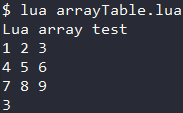
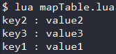
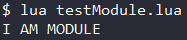

<div id="table进阶"></div>

# table 进阶
在[数据类型-table](1.数据类型.md/#table)中提到 : "粗浅的理解可将table视作 array 与 map 的合体" ;  
更准确的来说应该是 : "**table是Lua中用于构建不同数据类型的类型**, 如 array 与 map 等" .  
甚至Lua中的module, package, Object这些概念都是基于table所构建的 , table在Lua中的重要性可见一斑 .  

**成员方法** : 与string一样 , Lua也提供了table类 , 其包含了许多成员方法用于方便的操作table .  

#### 对table的使用方式
- 作为Array使用
- 作为Map使用
- 作为Module与Package使用
- 作为Object使用

#### table的引用赋值
Lua中table的赋值实质的引用 , 若两个table变量同时引用了同一块资源 , 当删除一个变量时资源不会被删除 .  
**只有最后一个引用该资源的变量被删除了 , 资源才会被释放** .

---

<div id="array"></div>

## 将 table 用作 array 
使用table时不指定元素的key , 并且使用`[]`来选定元素 , 即可实现 array 的功能 .  

Lua table 使用关联型数组 , 可在一个数组中插入不同类型的值(nil除外) . 同时其也是不定长的 , 可任意扩充内容 .  
(将table用作array在使用上更像使用C++STL中的vector)

#### 示例 (Code/tableLua/arrayTable.lua)
```Lua
-- 数组测试
local array = {"Lua", "array", "test"}  -- 创建数组
local lineStr = ""
for i = 1, 3 do                         -- 遍历数组
  lineStr = lineStr .. array[i] .. " "  -- 通过下表取得元素
end
print(lineStr)
-- 多维数组测试
local multiArray = {{1, 2, 3},          -- 创建三维数组
                    {4, 5, 6},
                    {7, 8, 9}}
for i = 1, 3 do                         -- 遍历并输出三维数组
  local lineStr = ""
  for j = 1, 3 do
    lineStr = lineStr .. multiArray[i][j] .. " "
  end
  print(lineStr)
end
print(#multiArray)                      -- 输出多维数组的行数
```
#### 输出


---

<div id="map"></div>

## 将 table 作为 map
使用table时以键值对的形式存入元素 , 并用`.`来指定特定key的value , 即可实现 map 的功能 .  

Lua中table底层设计参考了散列表 , 因此其键值对在容器中是无序的 . 使用上更接近C++中的unordered_map .  
#### 示例 (Code/tableLua/mapTable.lua)
```Lua
local map = {}       -- 创建字典
map.key1 = "value1"  -- 向字典中插入键值对
map.key2 = "value2"
map.key3 = "value3"
for key, value in pairs(map) do  -- 遍历输出键值对
  print(key .. " : " .. value)
end
```
#### 输出


---

<div id="modulepackage"></div>

## 将 table 作为 Module 与 Package
将模块/包的相关属性与方法放入同一个table中 , 使用`.`调用 , 即可实现模块与包的功能 .  

在Lua中 , function 是数据类型的一种 , 同时 table 允许存入不同类型的变量 .  
将以上两种特性结合一下 , 即可使用 table 实现模块与包的功能 .  

#### 创建模块
1. 在单独的lua文件中创建一个table  
`module = {}`
2. 写入该模块的常量与函数  
`module.constant = xxx` / `function module.fun() xxx end`
3. 返回该table  
`return module`

#### 加载模块
- **Lua模块** : 使用 `require('模块名')` 或 `require '模块名'` 加载Lua模块
- **C包** : 使用 `package.loadlib("路径")` 加载模块 , 使用 `assert(模块)` 打开模块

#### 示例 (Code/tableLua/moduleTable.lua 与 testModule.lua)
`moduleTable.lua`
```Lua
-- 自定义模块 module
module = {}                   -- 创建表   
module.constant = "MODULE"    -- 定义常量
local function privateFunc()  -- 定义私有函数
  print("I AM " .. module.constant)
end
function module.testFunc()    -- 定义公有函数
  privateFunc()
end
return module                 -- 返回表
```
`testModule.lua`
```Lua
require "moduleTable"  -- 加载模块
module.publicFunc()    -- 调用模块
```
#### testModule.lua输出


---

<div id="object"></div>

## 将 table 作为 Object
Lua中 , 模块与包的功能也可基于table实现 , 同样的也可以利用table实现对象的功能 .  

***但基于现有的知识还不能完全实现对象的功能*** : 
- 虽然可以通过table封装变量与方法 , 但**无法实现类的实例化** (或者说只能对类操作 , 无法对对象操作)
- 当学习过 [Metatable 元表](5.元表与协程.md/#元表) 后 , 即可配合元表实现 类与对象的功能 了, 进一步还可以实现OOP .  

---

<div id="成员方法"></div>

## table成员方法
Lua提供了table类 , 其有很多实用的成员方法提供对表的操作 .  (这里的table不是代指某一字符串 , 而是一个类叫做table) 

### table.concat(list, [sep], [i], [j])
**元素拼接** : 列表`list`中所有元素都是字符串或数字 , 返回字符串 `list[i]`到`list[j]` , 中间间隔`sep` .  
(`sep`缺省nil, `i`缺省1, `j`缺省#list)
```Lua
local tab = {"123", 456, "789"}
table.concat(tab, "a", 1, #tab)  --> 返回 123a456a789
```

### table.insert(list, pos, value)
**插入元素** : 往表`list`的`pos`位置插入一个值为`value`的元素 , 无返回值 .  
```Lua
local tab = {123, 789}
table.insert(tab, 2, 456)  --> 插入后的tab {1:123 , 2:456 , 3:789}
```

### table.remove(list, [pos])
**删除元素** : 删除表`list`中`pos`位置的元素 , 返回`被删除的值` . (`pos`缺省#list , 即最后一个 , 只能是数字)
```Lua
local tab = {k1="v1", 123, k2="v2", 456}
table.remove(tab, 2) --> 返回456 , tab = {k1:"v1", 1:123, k2:"v2"}
```

### table.sort(list, [comp])
**表排序** : 将表`list`根据函数`comp`的规则排序 , 无返回值 .  
(`comp`为两个参数返回值为boolean的函数 , 类似C++STL中的仿函数 , 缺省值是一个顺序排序的函数)
```Lua
local tab = {3, 1, 4, 2}
local function forwardSort(a, b)  -- 与[comp]的缺省值功能相同
  if a < b then return true else return false end
end
table.sort(tab, forwardSort)  --> tab = {1:1, 2:2, 3:3, 4:4}
```

### table.pack(...)  (Lua 5.2新增)
**包装表** : 将所有参数作为值依次填入新表并返回 , 并在最后增加一个键值对 `n : 参数个数`
```Lua
local newTab = table.pack("v1", 123, "v2", 456)
-- newTab = {1:"v1" , 2:132 , 3:"v2" , 4:456 , n:4}
```

### table.unpack(list, [i], [j]) (Lua 5.2新增)
**拆分表** : 返回表`list`中位置从`i`到`j`的元素的值 . (`list`内元素不变)  
(`i`缺省1, `j`缺省#list)
```Lua
local tab = {3, 1, 4, 2}
table.unpack(tab, 2, 3)  --> 返回 1 4
local newTab = table.pack(table.unpack(tab, 2, 3))  -->newTab={1:1 , 2:4 , n:2}
```

### table.move(a1, f, e, t, [a2]) (Lua 5.3新增)
**移动元素** : 将表`a1`中索引从`f`到`e`的元素 , 移动到表`a2`索引为`t`的位置之后 , 无返回值 .  
(`a2`缺省`a1`)
```Lua
local tab = {123, 456, 789}
tab = table.move(tab, 1, 2, 3)  --> 返回 {1:123 , 2:456 , 3:123 , 4:456}
```

### table.maxn(table) (Lua 5.2弃用)
**获取最大值** : 返回表`table`的最大正数索引，如果表没有正数索引，则返回零。