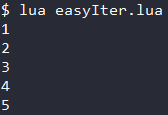
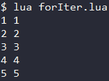

<div id="iterator"></div>

# iterator 迭代器

在Lua中也有迭代器的概念 , ***Lua中的迭代器与C++中的迭代器有所异同*** : 
- **相同点** : Lua与C++中迭代器都是用于遍历一个容器的 ; 
- **不同点** : C++的迭代器是特殊的类 , Lua的迭代器则是由 function 或 function + table 实现 .  

#### 使用Lua中的迭代器的方式
- 自定义迭代器函数并使用
- 使用Lua提供的迭代器函数

---

<div id="自定义迭代器"></div>

# 自定义迭代器

Lua中迭代器均以 function 的形式出现 , 部分迭代器内部也配合使用了 table .  

#### 构造迭代器的基本思想 : 
- 实现一个 function , 其可以在多次调用的期间保存"状态" .
- 利用这个"状态"使其每次每次调用都返回集合内"下一个"个元素 .  

#### 实现迭代器的常用方式 : 
1. 基本迭代器 : 利用闭合函数实现 ;
2. 无状态迭代器 : 借助泛型for三种状态值实现 ;
3. 多状态迭代器 : 利用table保存状态实现 ;

## 基本迭代器 - 利用闭合函数实现
基本迭代器借助了闭合函数 , 闭合函数能够保持每次调用之间的一些状态 .  

#### 闭合函数 closure 与 非局部变量 non-local variable 与 词法域
- ***词法域*** : 若一个函数定义于另一个函数内 , 则内部函数可访问外部函数的局部变量 .  
- ***非局部变量 non-local variable*** : 既不是某个域的局部变量 , 由不是全局变量的变量 .  
对于上述内部函数而言 , 其外部函数的局部变量就是它的 非局部变量 .
- ***闭合函数 closure*** : closure 是由一个 **function** 与其所需访问的所有 **非局部变量** 所组成 .  
因此即便外部函数已经返回 , 其局部变量中作为 内部函数所需的非局部变量 , 将为了内部函数而保存状态 .  
(从字面来看闭合函数好像是函数的特例 , 但从技术角度上看 function 才是 closure 的特例)
#### 示例 (Code/iterator/easyIter.lua)
```Lua
local function iter(tab)   -- 实现迭代器
  local x = 0              -- 闭合函数 的 非局部变量 (虽然在 function 外 , 但它是 closure 的一部分)
  return function ()       -- 闭合函数 closure 
    x = x + 1
    return tab[x]
  end
end
local tab = {1, 2, 3, 4, 5}
local tabIter = iter(tab)  -- 获取迭代器
for value in tabIter do    -- 使用迭代器
  print(value)
end
```
#### 输出
  
通过例子可见 , 使用closure实现iterator , 将使得每一轮循环都要创建新的匿名函数 .  
这样的开销某些情况下是无法接受的 , 无状态迭代器则没有这一问题 . 

## 无状态迭代器 - 利用泛型for实现
所谓无状态迭代器 , 即实现迭代器的function自身不保存状态 , 状态交由**泛型for的状态保存机制**来保存 .  

#### 泛型for的状态保存机制
泛型for在控制循环的过程中实际上保存着3个值 : `迭代器函数` , `恒定状态` , `控制变量` .  
每轮for循环将上一轮的3个值传递进函数 , 同时获得新的3个值 , 如此往复从而保存状态 .  

#### 示例 (Code/iterator/forIter.lua)
```Lua
local function iter(tab, idx)    -- 迭代器定义
  idx = idx + 1
  local val = tab[idx]
  if val then
    return idx, val
  end
end
local function pairs(tab)        -- 包装器定义
  return iter, tab, 0            -- 迭代器函数iter , 恒定状态tab , 控制变量初始值0
end
local tab = {1, 2, 3, 4, 5}
for key, value in pairs(tab) do  -- 使用迭代器  --> 1 1 \n 2 2 \n 3 3 \n 4 4 \n 5 5 \n
  print(key .. " " .. value)
end
```
#### 输出


## 多状态迭代器 - 利用table实现