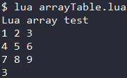
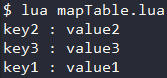
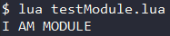

<div id="string进阶"></div>

# string 进阶
Lua中有三种方式表达一个字符串 : 
- **用单引号包围** : `' string '` ;
- **用双引号包围** : `" string "` ;
- **用双中括号包围** : `[[ string ]]` ;

为了方便地使用字符串 , Lua提供了如下"功能" :
- **转义字符** : 转义字符用于表示字符串中不能直接显示的字符 ;
- **成员方法** : string类有很多实用的成员方法 ;
- **格式化** : 类似C中printf()的字符串格式化 , 常用于string.format()方法; 
- **匹配模式** : 类似正则表达式一样的匹配 , 常用于string.find(), string.gmatch(), string.gsub(), string.match()方法 ;
## 转义字符
Lua中字符串的转义字符与C/C++一样 , 都是一个`\`加上特殊的字符 . 个别语法上有些许差别 .  
|转义字符|意义|ASCII码 (十进制)|
|-------|----|---------------|
|**\a**|**响铃** (BEL) . 让系统发出一个提示音|007|
|**\b**|**退格** (BS) . 将当前位置移动到前一列|008|
|**\f**|**换页** (FF) . 将当前位置移动到下一页开头|012|
|**\n**|**换行** (CR) . 将当前位置移动到下一行开头|010|
|**\r**|**回车** (CR) . 将当前位置移动到本行开头|013|
|**\t**|**水平制表** (HT) . 跳到下一个TAB位置|009|
|**\v**|**垂直制表** (VT)|011|
|**\\\\**|**\\** 一个放斜杠字符|092|
|**\\'**|**'** 一个单引号字符|039|
|**\\"**|**"** 一个双引号字符|034|
|**\0**|**空字符** (NULL)|000|
|**\ddd**|**1-3位八进制数** (d代表数字 , 数量可调整)|3位八进制|
|**\xhh**|**1-2位十六进制数** (h代表数字 , 数量可调整)|2位十六进制|
## 成员方法
Lua提供了string类 , 其有很多实用的成员方法提供对字符串的操作 .  (这里的string不是代指某一字符串 , 而是一个类叫做string)  
### string.upper(s) / string.lower(s)
**转换大小写** . 前者将参数字符串`s`转换为大写字母并返回 , 后者将参数字符串`s`转换为小写字母并返回 .   
```Lua
string.upper("qwerty")  --> 返回 QWERTY
string.lower("QWERTY")  --> 返回 qwerty
```
### string.gsub(s, pattern, repl, [n])
**替换字符串** . `s`字符串中`n`个`pattern`字符替换为`repl`字符 , `n`缺省为#str(替换全部) .  
```Lua
string.gsub("aaaa", "a", "z", 3)  --> 返回 zzza
```
### string.find(s, pattern, [init], [plain])
**搜索字符串** . 在`s`中从`init`处开始搜索第1个出现的`pattern`, 返回其`起始位置和结束位置` . `init`缺省1, `plain`不知道啥用 .  
```Lua
string.find("Hello Lua user", "Lua ", 1)  --> 返回 7 10 (匹配的是"Lua "有一个空格)
```
### string.reverse(s)
**反转字符串** . 将参数字符串`s`反转后返回 .  
```Lua
string.reverse("Lua") --> 返回 auL
```
### string.format(s, ...)
**字符串格式化** . 类似C中的printf() , 但结果作为返回值返回而不是输出 .  
```Lua
string.format("the value is : %d", 4) --> 返回 the value is : 4 (是返回不是输出)
```
### string.char(byte, ...) / string.byte(s, [i], [j])
**字符串转换** . 前者将整型按照ASCII码转换为字符并拼接 , 后者将字符串`s`的第`i`到`j`个字符转换为整型 .  
(string.byte中 : **i缺省1, j缺省i, 负数表示从末尾开始的某个字符**)  
```Lua
string.char(97, 98, 99, 100)  --> 返回 abcd
string.byte("ABCD")           --> 返回 68
string.byte("ABCD", 4)        --> 返回 65
string.byte("ABCD", 2, 4)     --> 返回 66 67 68
```
### string.len(s)
**计算长度** . 返回参数字符串`s`的长度 .  
```Lua
string.len("qwer")  --> 返回 4
```
### string.rep(str, n)  string.rep(s, n, [sep])
**拷贝字符串** . 返回字符串`s`的`n`个拷贝, 以字符串`sep`为分隔符 . `sep`默认为nil(没有分隔符)
```Lua
string.rep("abc", 2)  --> 返回 abcabc
```
### string.sub(s, i, [j])
**截取字符串** . 截取字符串`s`的第`i`到第`j`个字符, `j`缺省-1表示最后一个 , `i`若为负数则表示从末尾第-i个字符开始 .  
```Lua
string.sub("qwerty", -2)  --> 返回 ty (-2表示截取末尾两个)
```
### string.match(str, pattern, [init]) string.match(s, pattern, [init])
**查找配对** . 返回`s`字符串的第一个符合`pattern`描述的子集的 ***值*** , `init`表示查找的起点 , 缺省为1 .  
```Lua
print(string.match("Hello Lua user", "%a+", 2)) --> 返回 ello
```
### string.gmatch(str, pattern) string.gmatch(s, pattern, [init])
**迭代查找配对** . 每调用一次 , 返回`s`字符串的下一个符合`pattern`描述的子集的 ***迭代器*** , `init`表示查找的起点 , 缺省为1 .
```Lua
for word in string.gmatch("Hello Lua user", "%a+") do print(word) end 
--[[输出 
    Hello
    Lua
    user]]
```

## 字符串格式化
`string.format(s, ...)`方法使用类似C中printf()的格式化方法 , 其占位符也与C中的差不多 .  

#### 字符串格式化的占位符包括 : 
|占位符|含义|
|-|-|
|**%c**|**字符** . 接受一个数字 , 并转为ASCII码对应的字符|
|**%d** / **%i**|**有符号整数** . 接受一个数字 , 并转为有符号整数|
|**%u**|**无符号整数** . 接受一个数字 , 并转为无符号整数|
|**%o**|**八进制数** . 接受一个数字 , 并转为八进制数|
|**%x** / **%X**|**十六进制数** . 接受一个数字 , 并转为十六进制数 . 前者用小写字母 , 后者用大写字母|
|**%e** / **%E**|**科学记数法** . 接受一个数字 , 并转为科学计数法 . 前者用小写字母 , 后者用大写字母|
|**%f**|**浮点数** . 接受一个数字 , 并转为浮点数|
|**%g** / **%G**|**科学计数法/浮点数中简短者** . 接受一个数字 , 并转为%e/%E及%f中简短的一种格式|
|**%s**|**字符串** . 接受一个字符串 , 并按照给定的参数格式化该字符串|
|**%q**|**安全字符串** . 接受一个字符串 , 并转为克被Lua编译器安全读入的格式|

#### 占位符的进一步细化 , 在%后添加参数 :
- **符号** : 一个 `+` 表示显示正数的正号
- **占位符** : 一个 `0` 表示该字串至少占用的位置
- **对齐标识** : 一个 `-` 表示该字串左对齐 , 默认右对齐 . 使用这个的前提是指定了字串宽度
- **宽度数值** : 一个 `数字` 表示该字串的显示宽度(不足补空格)
- **小数位数/字串裁切** : 一个 `.数字` 表示该字串显示的长度 , 若为浮点数则表示保留的小数位数

## 匹配模式
在方法`string.find()`, `string.gmatch()`, `string.gsub()`, `string.match()`中 , 可以使用匹配字串 .
Lua中的匹配字串直接用常规的字符串描述 , 匹配字串方便我们筛选需要的字符串 .  

#### Lua支持的所有字符类
|字符类|描述|
|-|-|
|**单个字符**|**单个字符** . 与该字符自身配对 , 但 ^ $ ( ) % . [ ] * + - ? 除外|
|**.**|**一个字符** . 与任何字符配对|
|**%a**|**一个字母** . 与任何字母配对|
|**%c**|**一个控制字符** . 与任何控制字符配对 (如 \n )|
|**%d**|**一个数字** . 与任何数字配对|
|**%l**|**一个小写字母** . 与任何小写字母配对|
|**%u**|**一个大写字母** . 与任何大写字母配对|
|**%w**|**一个数字或字母** . 与任何数字或字母配对|
|**%p**|**一个标点** . 与任何标点配对|
|**%s**|**一个空白** . 与空白字符配对|
|**%x**|**一个十六进制数** . 与任意十六进制数配对|
|**%z**|**一个0** . 与任何代表0的字符配对|
|**%(^$()%.[]\*+-?**)|**一个特殊字符** . 与(^$()%.[]\*+-?)这些字符自身配对
|**\[数个字符类\]**|**括号中的任意值** . 例如\[%l_\]与一个小写字母或一个_配对|
|**\[^数个字符类\]**|**非括号中的任意值** . 例如\[%l_\]与一个小写字母或一个_除外的字符配对|

#### 匹配模式的进一步细化 , 模式条目 :
- 单个字符类匹配该类别中的任意**单个**字符 ;
- 单个字符类跟一个 `*` , 表示匹配**0个或多个**的该类字符 , 优先匹配最长的 ;
- 单个字符类跟一个 `+` , 表示匹配**1个或多个**的该类字符 , 优先匹配最长的 ;
- 单个字符类跟一个 `-` , 表示匹配**0个或多个**的该类字符 , 优先匹配最短的 ;
- 单个字符类跟一个 `?` , 表示匹配**0个或1个**的该类字符 , 优先匹配1个的 ;

---

<div id="table进阶"></div>

# table 进阶
在[数据类型-table](1.数据类型.md/#table)中提到 : "粗浅的理解可将table视作 array 与 map 的合体" ;  
更准确的来说应该是 : "**table是Lua中用于构建不同数据类型的类型**, 如 array 与 map 等" .  
甚至Lua中的module, package, Object这些概念都是基于table所构建的 , table在Lua中的重要性可见一斑 .  

**成员方法** : 与string一样 , Lua也提供了table类 , 其包含了许多成员方法用于方便的操作table .  

#### 对table的使用方式
- 作为Array使用
- 作为Map使用
- 作为Module与Package使用
- 作为Object使用

<div id="array"></div>

## 将 table 用作 array 
使用table时不指定元素的key , 并且使用`[]`来选定元素 , 即可实现 array 的功能 .  

Lua table 使用关联型数组 , 可在一个数组中插入不同类型的值(nil除外) . 同时其也是不定长的 , 可任意扩充内容 .  
(将table用作array在使用上更像使用C++STL中的vector)

#### 示例 (Code/tableLua/arrayTable.lua)
```Lua
-- 数组测试
local array = {"Lua", "array", "test"}  -- 创建数组
local lineStr = ""
for i = 1, 3 do                         -- 遍历数组
  lineStr = lineStr .. array[i] .. " "  -- 通过下表取得元素
end
print(lineStr)
-- 多维数组测试
local multiArray = {{1, 2, 3},          -- 创建三维数组
                    {4, 5, 6},
                    {7, 8, 9}}
for i = 1, 3 do                         -- 遍历并输出三维数组
  local lineStr = ""
  for j = 1, 3 do
    lineStr = lineStr .. multiArray[i][j] .. " "
  end
  print(lineStr)
end
print(#multiArray)                      -- 输出多维数组的行数
```
#### 输出


<div id="map"></div>

## 将 table 作为 map
使用table时以键值对的形式存入元素 , 并用`.`来指定特定key的value , 即可实现 map 的功能 .  

Lua中table底层设计参考了散列表 , 因此其键值对在容器中是无序的 . 使用上更接近C++中的unordered_map .  
#### 示例 (Code/tableLua/mapTable.lua)
```Lua
local map = {}       -- 创建字典
map.key1 = "value1"  -- 向字典中插入键值对
map.key2 = "value2"
map.key3 = "value3"
for key, value in pairs(map) do  -- 遍历输出键值对
  print(key .. " : " .. value)
end
```
#### 输出


<div id="modulepackage"></div>

## 将 table 作为 Module 与 Package
将模块/包的相关属性与方法放入同一个table中 , 使用`.`调用 , 即可实现模块与包的功能 .  

在Lua中 , function 是数据类型的一种 , 同时 table 允许存入不同类型的变量 .  
将以上两种特性结合一下 , 即可使用 table 实现模块与包的功能 .  

#### 创建模块
1. 在单独的lua文件中创建一个table  
`module = {}`
2. 写入该模块的常量与函数  
`module.constant = xxx` / `function module.fun() xxx end`
3. 返回该table  
`return module`

#### 加载模块
- **Lua模块** : 使用 `require('模块名')` 或 `require '模块名'` 加载Lua模块
- **C包** : 使用 `package.loadlib("路径")` 加载模块 , 使用 `assert(模块)` 打开模块

#### 示例 (Code/tableLua/moduleTable.lua 与 testModule.lua)
`moduleTable.lua`
```Lua
-- 自定义模块 module
module = {}                   -- 创建表   
module.constant = "MODULE"    -- 定义常量
local function privateFunc()  -- 定义私有函数
  print("I AM " .. module.constant)
end
function module.testFunc()    -- 定义公有函数
  privateFunc()
end
return module                 -- 返回表
```
`testModule.lua`
```Lua
require "moduleTable"  -- 加载模块
module.publicFunc()    -- 调用模块
```
#### testModule.lua输出


<div id="object"></div>

## 将 table 作为 Object
Lua中 , 模块与包的功能也可基于table实现 , 同样的也可以利用table实现对象的功能 .  

***但基于现有的知识还不能完全实现对象的功能*** : 
- 虽然可以通过table封装变量与方法 , 但**无法实现类的实例化** (或者说只能对类操作 , 无法对对象操作)
- 当学习过 [Metatable 元表](5.元表与协程.md/#元表) 后 , 即可配合元表实现 类与对象的功能 了, 进一步还可以实现OOP .  