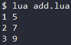
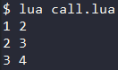
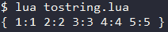
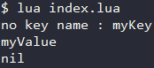
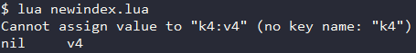
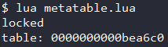

<div id="元表"></div>

# Metatable 元表
元表是table的一种特例 , 其用于定义对table或userdata操作方式 (如两个table的加法运算等).  

***例如*** : 现需要对表`tab1`, `tab2`执行加法运算 (tab1 + tab2) . Lua将做出如下判断 :
1. 查看`tab1`是否有元表 , 若有则查看`tab1`的元表是否有`__add`**元方法** , 若有则调用 .
2. 查看`tab2`是否有元表 , 若有则查看`tab2`的元表是否有`__add`**元方法** , 若有则调用 .
3. 若二者都没有对应的`__add`**元方法** , 则报错 .  

因此 , 通过给table设置元表 , 并为其元定义`__add`元方法 , 即可实现该table的加法运算 .

---

# 设置元表 / 获取元表
### setmetatable(table, metatable) - 设置元表
`setmetatable(table, metatable)` 设置 `table` 的元表为 `metatable` , 并返回 `table` . 
- 若元表中存在`__metatable`键值 , 则函数setmetatable失败 .  
### getmetatable(object) - 获取元表
`getmetatable(object)` 获取 `object` 的元表并返回 .  

---

# 元表的元方法
上例中`__add`就是Lua中的一个原方法 , Lua中还有其他的原方法 , 可供实现并使用 .
#### 常用元方法
|元方法|描述|
|-|-|
|**__add**|运算符 **+**|
|**__sub**|运算符 **-**|
|**__mul**|运算符 **\***|
|**__div**|运算符 **/**|
|**__mod**|运算符 **%**|
|**__unm**|运算符 **-** (取反)|
|**__concat**|运算符 **..**|
|**__eq**|运算符 **==**|
|**__it**|运算符 **<**|
|**__le**|运算符 **<=**|
|**__call**|当作函数调用|
|**__tostring**|转化为字符串|
|**__index**|调用一个索引|
|**__newindex**|给一个索引赋值|
|**__metatable**|用于设置访问元表的权限|

### __add元方法 与 其他运算符元方法
运算符元方法的使用方式都类似 , 以__add为例 :
#### __add 元方法使用示例 (Code/metatable/add.lua)
```Lua
local metaTab = {}                            -- 创建元表
metaTab.__add = function (leftTab, rightTab)  -- 定义元方法__add
  local addTab = {}
  for key, value in ipairs(leftTab) do        -- 对应索引的元素相加
    addTab[key] = value + rightTab[key]
  end
  return addTab                               -- 返回相加后的表
end
local tab1 = {1, 2, 3}
local tab2 = {4, 5, 6}
setmetatable(tab1, metaTab)                   -- 设置元表
setmetatable(tab2, metaTab)
local resTab = tab1 + tab2                    -- 对表进行加法运算
for key, value in pairs(resTab) do            -- 遍历输出  --> 1 5 \n 2 7 \n 3 9
  print(key .. " " .. value)
end
```
#### 输出


### __call 元方法的使用
`__call` 可以让 table 当作一个函数来使用 .  
**注意** : `__call` 的第一个参数需要设置为表自身 .  
#### _call示例 (Code/metatable/call.lua)
```Lua
local meteTab = {}                       -- 构造元表
meteTab.__call = function(myTable, ...)  -- 实现方法__call , 第一个参数是自身
  return {...}                           -- 返回以所有参数作为索引的表
end
local tab = {1, 2, 3, 4, 5}
setmetatable(tab, meteTab)               -- 设置元表
local resTab = tab(2, 3, 4)              -- 以函数的方式调用表
for key, value in pairs(resTab) do       -- 循环输出  --> 1 2 \n 2 3 \n 3 4
  print(key .. " " .. value)
end
```
#### 输出


### __tostring 元方法的使用
`__tostring` 元方法可以修改table , 将其转化为字符串(可以像字符串一样被print()输出) .  
**注意** : `__tostring` 的参数(唯一参数)为表自身
#### __tostring示例 (Code/metatable/tostring.lua)
```Lua
local metaTab = {}  -- 构造元表
metaTab.__tostring = function(myTable)  -- 实现__tostring元方法 , 参数为表自身
  local str = "{ "                       -- 将表中内容转为字符串格式
  for key, value in pairs(myTable) do
    str = str .. key .. ":" .. value .. " "
  end
  str = str .. "}"
  return str
end
local tab = {1, 2, 3, 4, 5}
setmetatable(tab, metaTab)              -- 设置元表
print(tab)                              -- 像string一样输出表  --> { 1:1 2:2 3:3 4:4 5:5 }
```
#### 输出


### __index 元方法的使用
当调用table的一个不存在的索引时 , 会使用到 `__index` 元方法 .  
**注意** : `__index` 可以是一个函数 , 也可以是一个table .  

- ***作为函数*** : 将表和这个不存在的索引作为参数传入 , return 一个返回值 .  
- ***作为table*** : 调用不存在的索引时 , 将查找这个table , 若有该索引则返回对应的值 , 否则返回nil .  
#### __index示例 (Code/metatable/index.lua)
```Lua
local metaTab = {}                        -- 构造元表
local tab = {1, 2, 3, 4, 5}
setmetatable(tab, metaTab)                -- 设置元表
-- 作为function --
metaTab.__index = function(myTable, key)  -- 实现__index元方法 , 第一个参数为表自身 , 第二个参数为不存在的那个索引
  return "no key name : " .. key          -- 提示没有这个key
end
print(tab.myKey)                          -- 尝试调用不存在的索引 --> no key name : myKey
-- 作为table --
metaTab.__index = {myKey="myValue"}       -- 设置 __index 元方法表
print(tab.myKey)                          -- 尝试调用不存在的索引 , 但该索引存在元方法表中 --> myValue
print(tab.mykey)                          -- 尝试调用不存在的索引 , 该索引不存在元方法表中 --> nil
```
#### 输出


### __newindex 元方法的使用
为table中一个不存在的索引赋值时 , 将调用元表中的`__newindex`元方法 .  
**注意** : `__newindex` 与 `__index` 一样 , 可以作为一个function也可以作为一个table . 
- ***作为function*** : 将赋值语句中的`表` , `索引` , `值`当作参数去调用 , 不对表进行改变 .  
- ***作为table*** : 将该`索引`和`值`赋到`__newindex`所指向的表中 , 不对原有的表做出改变 .  
#### __newindex示例 (Code/metatable/newindex.lua)
```Lua
local metaTab = {}                              -- 构造元表
local tab = {k1="v1", k2="v2", k3="v3"}
setmetatable(tab, metaTab)                      -- 设置元表
-- 作为function --
metaTab.__newindex = function(myTab, idx, val)  -- 实现__newindex元方法 , 参数 : 表自身 , 索引 , 值
  print("Cannot assign value to \""..idx..":"..val.."\" (no key name: \""..idx.."\")")
end                                             -- 输出错误提示
tab.k4 = "v4"
-- 作为table --
local errTab = {}
metaTab.__newindex = errTab  --> Cannot assign value to "k4:v4" (no key name: "k4")
tab.k4 = "v4"
print(tab.k4, errTab.k4)     --> nil	v4
```
#### 输出


### __metatable 的使用
`__metatable` 作为字符串出现 , 当一个表被设置为其他表的元表时 , 自动获得`__metatable=nil` .  
一个拥有`__metatable`属性的表不可以被设置为其他表的元表 .  

- 通过设置元表的`__metatable`为一个字符串 , 可以禁止访问该元表中的成员或修改元表 .  
- 当出现这些操作时 , 自动返回该字符串 .  

#### __metatable 示例 (Code/metatable/metatable.lua)
```Lua
local metaTable = {}              -- 构造元表
local tab = {}
setmetatable(tab, metaTable)      -- 设置元表
metaTable.__metatable = "locked"  -- 禁止访问元表 , 设置访问失败提示词
print(getmetatable(tab))          -- 尝试访问元表失败 --> locked
metaTable.__metatable = nil       -- 解锁
print(getmetatable(tab))          -- 再次访问元表成功 --> table:xxxxx
```
#### 输出


### rawget(table, index) 与 rawset(table, index, value)
- `rawget(table, index)` 可以直接获取表`table`中索引`index`的实际值(**nil**) , 绕过 `__index` . 
- `rawset(table, index, value)` 可以直接为表`table`中的索引`index`赋值(**插入新元素**) , 绕过 `__newindex` .  

---

# 元表的使用场景
- **作为table的元表** : 通过table设置元表 , 可以实现[Lua中的面向对象编程](6.面向对象与文件操作.md/#面向对象)
- **作为userdata的元表** : 通过对userdata设置元表 , 可以实现Lua对C结果进行面向对象式的访问 .  
