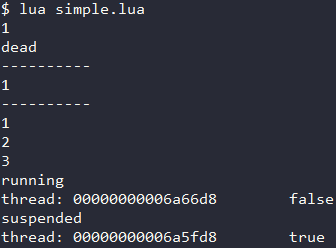
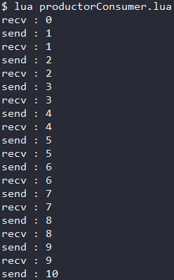

<div id="协程"></div>

# Coroutine 协程
协程的工作模式与进程/线程不同 , 其既不并发也不并行 , 其通过在多个任务之间跳转执行 . 正如其名"协作程序" .  
#### 协程的特点
- 如同一个进程可以拥有多个线程 , **一个线程可以拥有多个协程** .  
- 不同于进程与线程的抢占性 , **协程是非抢占性的**(协程的挂起与执行完全依靠程序逻辑) .
- 不同于进程与线程的并发性 , **在同一时刻 , 只能有一个协程在运行** .  
- **协程不被操作系统内核管理** (用户态) , 不会像线程切换那样消耗资源 .  

---

# Lua中的协程相关函数
Lua中的coroutine包含了多个成员方法 , 其用于控制协程 .  
### coroutine.create(f)
**创建协程** : 传入该协程的主体函数 `f` , 返回该协程 (一个thread类型变量) .  
使用该方法创建的协程 , 需要调用`resume()`函数运行 .  
### coroutine.wrap(f)
**创建协程** : 传入该协程的主体函数 `f` . 返回一个函数 , 每次调用其都可以延续该协程 .  
使用该方法创建的协程 , 需要调用`thread变量`运行(以一个函数的形式调用它) .  
### coroutine.resume(co, [val1], ...)
**运行协程** : 开始或继续运行协程 `co` , 返回`启动的结果`和`yield给的值` . val代表主体函数的参数 .  
**参数** : 第一个是`协程变量` , 后面的参数是`主题函数的参数`/`上一次yield的返回值` .  
**返回值** : 第一个返回值是`启动的结果` , 后面的返回值是`主体函数的返回值`/`本次yield的参数` .  
### coroutine.yield(...)
**挂起协程** : 挂起正在调用的协程的执行 , 它的参数将作为本次`resume()`函数的返回值 .  
**参数** : 下次`resume()`的返回值 ; **返回值** : `本次resume()的参数` .  
### coroutine.close(co)
**关闭协程** : 关闭协程 `co` , 并关闭它所有等待 *to-be-closed* 的变量 , 并将协程状态设为 `dead` .
### coroutine.status(co)
**查看状态** : 返回协程 `co` 的运行状态 , 其可能是以下4种之一 : 
1. `"running"`   : 正在运行 .
2. `"suspended"` : 挂起或是还没有开始运行 .
3. `"normal"`    : 是活动的，但并不在运行 .
4. `"dead"`      : 运行完主体函数或因错误停止 .
### coroutine.isyieldable(co)
**检查协程是否可以挂起** : 返回协程 `co` 当前是否可以被挂起 .
### coroutine.running()
**获得当前运行的协程** : 返回当前正在运行的协程 , 同时返回一个布尔值(其表示该协程是否是主协程) .
#### 示例 (Code/coroutine/simple.lua)
```Lua
local co = coroutine.create(  --------- 创建协程
  function(i)  
    print(i)
  end
)
coroutine.resume(co, 1)  -------------- 运行协程  -----------> 1
print(coroutine.status(co))  ---------- 查看状态  -----------> dead
print("----------")
co = coroutine.wrap(  ----------------- 创建协程
  function(i)
    print(i)
  end
)
co(1)  -------------------------------- 运行协程  -----------> 1
print("----------")
co = coroutine.create(
  function()
    for i = 1, 10, 1 do
      print(i)
      if i == 3 then
        print(coroutine.status(co))  -- 查看状态  -----------> running
        print(coroutine.running())  --- 查看正在运行的协程  --> thread:xxx false
      end
      coroutine.yield()  -------------- 挂起协程
    end
  end
)
coroutine.resume(co)  ----------------- 运行协程  -----------> 1
coroutine.resume(co)  ----------------- 运行协程  -----------> 2
coroutine.resume(co)  ----------------- 运行协程  -----------> 3
print(coroutine.status(co))  ---------- 查看状态  -----------> suspended
print(coroutine.running())  ----------- 查看正在运行的协程  --> thread:xxx true
```
#### 输出


---

# 进阶
协程的特性使得其在某些情况下更有优势 , 例如生产者消费者模型 .  
相比于线程的实现 , 协程的实现天生不需要加锁 , 也天生负载均衡 .  
#### 使用协程实现生产者消费者模型 (Code/coroutine/productorConsumer.lua)
```Lua
local newProductor
MaxNum = 10

Productor = function()
  local num = 0
  while num < MaxNum do
    num = num + 1
    print("send : " .. num)
    Send(num)
  end
end

Consumer = function()
  local num = 0
  while num < MaxNum do
    print("recv : " .. num)
    num = Recv()
  end
end

Send = function(x)
  coroutine.yield(x)
end

Recv = function()
  local status, value = coroutine.resume(newProductor)
  return value, status
end

newProductor = coroutine.create(Productor)
Consumer()
```
#### 输出
