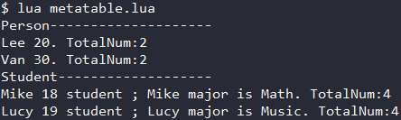
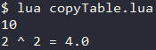
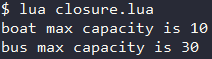

<div id="面向对象"></div>

# 面向对象
先前使用了 table + function 实现了 Object 类的功能 , 但是无法将其实例化 .  
配合 metatable 可以解决这一问题 .
#### Lua官方实现(模拟)OOP的方式
- **类定义** : 使用 metatable 描述类的属性与方法(一个new方法用于构造) .
- **实例化** : 使用 table 设置 metatable 与 __index 元方法(用new构造 , 从元表中取得属性与方法) .  
- **继承** : 使用另一个 metatable 与原 metatable 设置元表(继承关系) , 从而实现继承 .   

官方的做法是使用利用元表的特性从而模拟OOP , 实际上还有其他的实现(模拟)方式 .  
#### 实现继承的多种方式
- 利用元表实现 (官方做法)
- 利用复制表的方法实现
- 利用闭合函数实现

#### Lua对象(table)中的  `self`变量 与 `.` 与 `:`
- `.` 操作符 : 通过 `.` 操作符可访问类(table)的成员变量 / 成员函数 .  
- `:` 操作符 : 通过 `:` 操作符可访问类(table)的成员函数 , 同时将自动将 `self`参数 作为第一个参数传入 .  
- `self` 参数 : 如同C++中对象的this指针 , 指向对象自身 .  

定义成员方法时使用`.` , 类似于定义了一个"静态方法"(只是类似) , 其不会自动传入`self`参数(this指针) .  

---

<div id="利用元表实现OOP"></div>

# 利用元表实现OOP (官方做法)
Lua官方实现OOP的方式是利用元表与表的关系模拟出继承的关系
#### Lua官方实现(模拟)OOP的方式 (完整示例见 Code/oop/metatable.lua)
- **类定义** : 使用 metatable 描述类的属性与方法(一个new方法用于构造) .
- **实例化** : 使用 table 设置 metatable 与 __index 元方法(用new构造 , 从元表中取得属性与方法) .  
- **继承** : 使用另一个 metatable 与原 metatable 设置元表(继承关系) , 从而实现继承 .   
### 类定义
- 使用一个table(其作为metatable)定义出类的成员属性与方法(往里面塞各种不同类型的数据)
- 定义一个new方法 , 用于构造实例-返回table (其中要`设置元表关系` , 并`实现__index元方法`)
```Lua
print("Person--------------------")
-- 定义Person基类
Person = {
  -- 成员属性
  name = "" ,  -- 名字
  age = 0,     -- 年龄
  num = 0      -- 人数 (实例与子类实例的总数)
}
-- 构造方法
function Person:new(name, age)
  local newPerson = {}            -- 实例
  setmetatable(newPerson, self);  -- 设置实例的元表(基类)为Person类自身
  self.__index = self;            -- 设置当访问实例中不存在的属性时 , 来Person类找
  newPerson.name = name or ""     -- 为成员属性赋值
  newPerson.age = age or 0
  self.num = self.num + 1         -- 静态变量人数累加
  return newPerson                -- 返回构造好的实例
end
-- 成员方法
function Person:speak()
  print(self.name .. " " .. self.age .. ". TotalNum:" .. self.num)
end
```
### 实例化
- 调用基类(metatable)的new成员方法为变量赋值 , 该变量则为一个实例(本质还是table) .
```Lua
-- 实例化Person类
local personA = Person:new("Lee", 20)
local personB = Person:new("Van", 30)
personA:speak()
personB:speak()
```
### 继承
- 遵循类定义的方式再定义一个基类(metatable) , 同时设置两个基类(metatable)之间的继承(元表)关系 .
```Lua
print("Student-------------------")
-- 定义Student子类继承Person基类
Student = {
  -- 子类成员属性
  major = ""
}
-- 设置继承关系
setmetatable(Student, Person)
-- Student构造方法
function Student:new(name, age, major)
  local newStudent = Person:new(name, age)  -- 实例(调用基类构造方法)
  setmetatable(newStudent, self);  -- 设置实例的元表(基类)为Person类自身
  self.__index = self;             -- 设置当访问实例中不存在的属性时 , 来Person类找
  newStudent.major = major or ""
  return newStudent
end
-- Student子类特有成员方法
function Student:myMajor()
  print(self.name .. " major is " .. self.major .. ". TotalNum:" .. self.num)
end
-- Student子类重写基类Person的成员方法
function Student:speak()
  io.stdout:write(self.name .. " " .. self.age .. " student ; ")
end

-- 实例化Student类
local studentA = Student:new("Mike", 18, "Math")
local studentB = Student:new("Lucy", 19, "Music")
studentA:speak()
studentA:myMajor()
studentB:speak()
studentB:myMajor()
```
#### 完整示例的输出


---

<div id="利用表克隆函数实现OOP"></div>

# 利用复制表的方法实现OOP
利用一个复制表的函数 , 实现类之间的继承关系 以及 实例化的功能 .  
#### 复制表函数实现OOP的步骤 (完整示例见 Code/oop/copyTable.lua)
- **复制table函数** : 一个用于克隆table的函数 , 将自身完整的副本返回
- **定义类** : 用metatable定义基类 , 实现一个new方法用于构造实例 .
- **实例化** : 在类的new方法中 , 利用复制table函数将类复制一份 , 将副本作为实例 .
- **继承** : 利用复制table函数 , 复制一份基类 , 将副本作为子类 . 
### 复制table函数
一个全局函数 , 作用就是返回一个参数table的副本
```Lua
-- 全局函数 - 克隆表 : 返回参数表的副本
CloneTab = function(tab)
  local newTab = {}              -- 新表
  for key, val in pairs(tab) do  -- 将信标构造为参数表的副本表
    newTab[key] = val
  end
  return newTab                  -- 返回副本表
end
```
### 定义类
与用元表实现中的定义类相似 , 区别在于在new方法中 , 通过克隆自身构造实例
```Lua
-- Shape基类
Shape = {}                  -- 声明基类
Shape.area = 0              -- 基类成员属性
function Shape:new(area)    -- Shape构造方法 : 克隆自己并返回
  local newShape = CloneTab(self)
  newShape.area = area or 0
  return newShape
end
function Shape:printArea()  -- Shape成员方法 : 输出面积
  print(self.area)
end
```
### 实例化 
直接调用类的new方法构造实例
```Lua
-- 实例化 Shape
local shapeA = Shape:new(10)
shapeA:printArea()
```
### 继承
同样利用克隆基类获得副本(获得基类的属性与方法) , 并在这个副本上实现子类的完整定义 .
```Lua
-- 子类 Square : 继承 Shape
Square = CloneTab(Shape)     -- 设置继承关系并声明子类
Square.side = 0              -- 子类Square成员属性
function Square:new(side)    -- 子类Square构造方法 : 克隆自己并返回
  local newSquare = CloneTab(Square)
  newSquare.side = side or 0
  newSquare.area = (side^2) or 0
  return newSquare
end
function Square:printArea()  -- 子类Square重写基类Shape方法 : 输出面积
  print(self.side .. " ^ 2 = " .. self.area)
end
function Square:countArea()  -- 子类Square特有成员方法 : 计算面积
  self.area = self.side ^ 2
end
-- 实例化子类 Square
local square = Square:new(2)
square:printArea()
```
#### 完整示例的输出


---

<div id="利用闭合函数实现OOP"></div>

# 利用闭合函数实现OOP
利用closure的特性 , 可以将一个"类"的成员都封装在一个function内(closure可访问非局部变量 , 类似访问类内部的成员变量) .  
从而实现类定义与继承 .  
#### 利用闭合函数实现OOP的步骤 (完整示例见 Code/oop/closure.lua)
- **定义类** : 用一个function封装类的所有成员 , 其中内部函数因为closure的特性 , 可以访问到"类"内部成员 .
- **实例化** : 在"类"中实现构造方法 , 将构造好的新table返回 , 该table就是实例 .  
- **继承** : 在子类(function)中先获取一个基类实例 , 再定义出完整的子类 (子类的实例也是在基类实例的基础上构造而得).
### 定义类
用function实现类 , 需要一个self表作为实例 , 一个构造方法用于构造实例 , 其余的成员都可定义在其中(作为self表的元素) .
```Lua
-- 基类Vehicle
function Vehicle(name, capacity)
  local selfTab = {}                -- 实例(私有)
  selfTab.name = ""                 -- 成员属性 : 名称
  selfTab.capacity =  0             -- 成员属性 : 载客量
  local function init()             -- 构造方法(私有) : 闭合函数
    selfTab.name = name or ""
    selfTab.capacity = capacity or 0
  end
  function selfTab:printMsg()       -- 成员方法 : 输出自身信息
    print(self.name .. " max capacity is " ..self.capacity)
  end
  init()                            -- 构造实例
  return selfTab                    -- 返回实例
end
```
### 实例化
直接调用实现类的function , 获得实例 .
```Lua
-- 实例化Vehicle
local vehicleA = Vehicle("boat", 10)
vehicleA:printMsg()
```
### 继承
在子类中 , 用基类的实例先赋值self表 , 再实现子类的完整定义 .  
```Lua
-- 子类Car
function Car(name, capacity, wheels)
  local selfTab = Vehicle(name, capacity)  -- 继承基类(构造一个基类实例)
  selfTab.wheels = 0                       -- 成员属性 : 轮子数量
  local function init()                    -- 构造方法(私有) : 闭合函数
    selfTab.wheels = wheels or 0
  end
  function selfTab:printCap()              -- 重写基类成员方法 : 输出自身信息
    print(self.name .. " max capacity is " ..self.capacity .. " , and wheel num is " .. self.wheels)
  end
  init()                                   -- 构造实例
  return selfTab                           -- 返回实例
end
-- 实例化Car
local carA = Car("bus", 30, 4)
carA:printMsg()
```
#### 完整示例的输出
