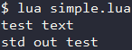
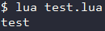

# 文件操作

Lua中的文件I/O分为两种模式 :
- **简单模式** : 使用io库 , 拥有一个当前输入文件和一个当前输出文件 , 并提供针对这些文件的相关操作 (和C一样) .
- **完全模式** : 使用句柄 , 以一种面向对象的形式 , 将所有文件操作定义为文件句柄的方法 .  

---

<div id="简单模式"></div>

# 简单模式
Lua中的io类提供了用于文件操作的方法 .  
#### 文件的打开模式
|模式|描述|
|-|-|
|**r**|读模式 , (读)|
|**w**|写模式 , (从头写)|
|**a**|追加模式 , (末尾写)|
|**r+**|更新模式 , 保留之前的所有数据|
|**w+**|更新模式 , 删除之前的所有数据|
|**a+**|追加更新模式 , 只可在末尾写入 , 保留之前的所有数据|
|**rb**|读模式 , (读) (二进制方式)|
|**wb**|写模式 , (从头写) (二进制方式)|
|**ab**|追加模式 , (末尾写) (二进制方式)|
|**r+b**|更新模式 , 保留之前的所有数据 (二进制方式)|
|**w+b**|更新模式 , 删除之前的所有数据 (二进制方式)|
|**a+b**|追加更新模式 , 只可在末尾写入 , 保留之前的所有数据 (二进制方式)|
#### Lua中的标准IO句柄
- **io.stdin** : 标准输入
- **io.stdout** : 标准输出
- **io.stderr** : 标准错误

### io.open(filename, mode)
**打开文件** : 通过 `mode` 模式打开文件 `filename` , 返回 `文件句柄` / `错误提示` .  
### io.close(file)
**关闭文件** : 关闭文件 `file` , 返回 `成功状态` + `退出代码` .  
### io.read([...])
**读取内容** : 读取打开的文件 , 参数指定读取的模式 , 其模式可以是以下四种 :
1. `*n` : 读取一个数字 ; 
2. `*a` : 从当前位置读取整个文件 ; 
3. `*l`缺省  : 读取下一行 , 遇到末尾返回nil ;
4. `number` : 返回指定字符个数的字符串 , 遇到末尾返回nil . 
### io.write(...)
**写入内容** : 向打开的文件中写入内容 , 参数指定了要写入的内容 .  
### io.input(file)
**设置默认输入** : 将文件 `file` 设置为默认输入文件 , 无返回值 .  
### io.output(file)
**设置默认输出** : 将文件 `file` 设置为默认输出文件 , 无返回值 .  
### io.flush()
**向默认输出写入** : 将写入的数据保存到默认输出文件中 , 无返回值 .  
### io.lines(filename, [...])
**行迭代器** : 返回文件`filename`的迭代器 , 每次迭代返回`一行的内容` , [...]为打开模式.  
### io.popen(prog, [mode])
**分离线程打开文件** : 分离一个线程开启程序`prog` , `mode` 指定了打开的模式 , 返回 `文件句柄` / `错误提示` .  
### io.tmpfile()
**临时文件句柄** : 若执行成功 , 则返回一个临时的文件句柄 .  
### io.type(file)
**检查句柄合法性** : 返回文件`file`句柄的合法性 , 返回值可以是以下几个 :
1. **file** : 是一个打开的文件句柄
2. **closed file** : 是一个关闭的文件句柄
3. **nil** : 不是文件句柄
#### 示例 (Code/file/simple.lua)
```Lua
local file                       -- 句柄

file = io.open("test.txt", "w")  -- 打开文件 (写模式)
io.output(file)                  -- 设置该文件为默认输出文件
io.write("test text")            -- 写入数据 (写到文件里)
io.close(file)                   -- 关闭文件

file = io.open("test.txt", "r")  -- 打开文件 (读模式)
io.input(file)                   -- 设置该文件为默认输入文件
print(io.read("*a"))             -- 读取数据 (全部数据) --> test text
io.close(file)                   -- 关闭文件

io.output(io.stdout)             -- 设置标准输出为默认输出文件
io.write("std out test")         -- 写入数据 (写入到stdout - 打印)  --> std out test
```
#### 输出


---

<div id="完全模式"></div>

# 完全模式
完全模式操作上与简单模式类似 , 用`句柄:方法`来代替`io.方法` .
### file:close()
**关闭文件** : 关闭该文件 , 返回`执行正确性` + `退出码` , 退出码是`exit`/`signal`二者其一 .  
### file:read(...)
**读取内容** : 读取该文件 , 参数指定读取的模式 , 其模式可以是以下四种 :
1. `n` : 读取一个数字，根据 Lua 的转换文法返回浮点数或整数 ; 
2. `a` : 从当前位置读取整个文件 ; 
3. `l`缺省 : 读取一行并忽略行结束标记 ;
4. `L` : 读取一行并保留行结束标记 . 
### file:write(...)
**写入内容** : 向该文件写入内容 , 参数指定内容 , 返回`文件句柄` + `[错误提示]` . 
### file:flush()
**向该文件写入** : 将写入的数据保存到该文件中 , 无返回值 . 
### file:lines(...)
**行迭代器** : 返回该文件的迭代器 , 每次迭代返回`一行的内容` , [...]为打开模式.
### file:seek([whence], [offset])
**设置位置** : 设置基于`whence`处偏移量为`offset`的位置 , 返回`偏移量`和`[错误提示]` , `whence`是如下几个其一 :
1. `set` : 基点为 0 (文件开头);
2. `cur`缺省 : 基点为当前位置 ;
3. `end` : 基点为文件尾 .
### file:setvbuf(mode, size)
**设置缓冲模式** : 设置该文件的缓存模式为`mode` , 缓冲区大小为`size` , 缓冲模式可以是以下几种 :
1. `no` : 不缓冲 , 输出操作立刻生效 ;
2. `full` : 完全缓冲 , 只有在缓存满或调用 flush 时才做输出操作 ;
3. `line` : 行缓冲 , 输出将缓冲到每次换行前 .
#### 示例 (Code/file/test.lua)
```Lua
local file                       -- 句柄

file = io.open("test.txt", "w")  -- 打开文件 (写模式)
file:write("text test")          -- 写入数据
file:close()                     -- 关闭文件

file = io.open("test.txt", "r")  -- 打开文件 (读模式)
file:seek("set", 5)              -- 跳转位置 (开头处5字节后)
io.stdout:write(file:read("L"))  -- 读取一行 , 输出  --> test
```
#### 输出
